# Student Performance Tracker
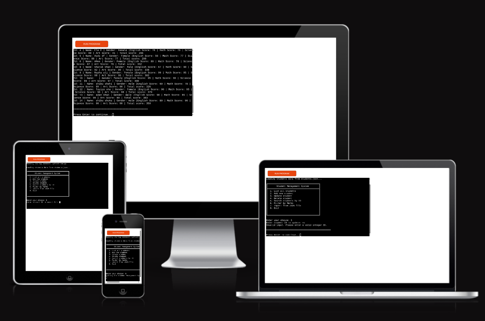
The Student Performance Tracker is a terminal-based application for managing
student records and tracking academic performance across multiple subjects.
It provides a menu-driven interface to create, view, update, delete, search,
and filter student records, with persistent storage in JSON.
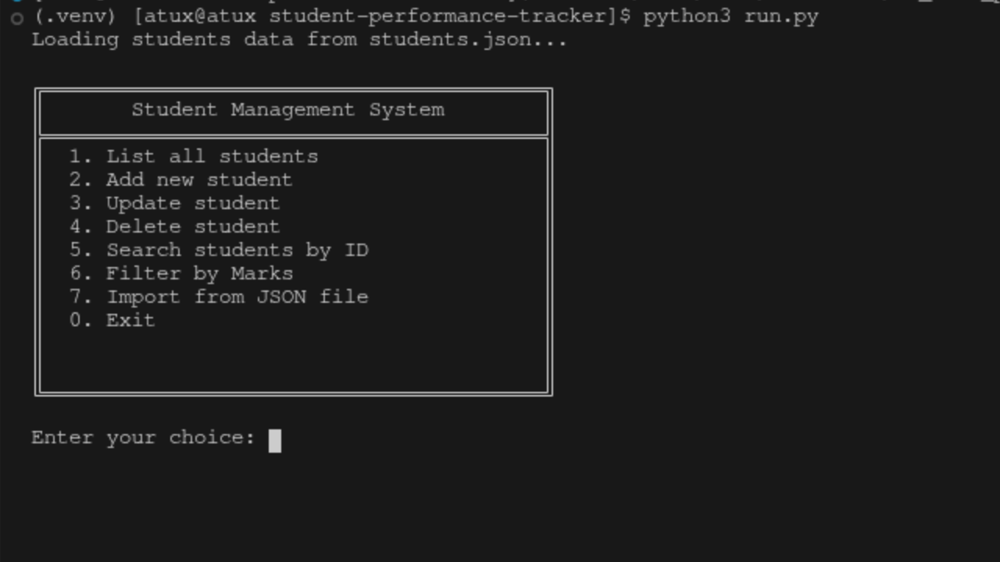

## Features
### Exisisting Features
   - List/view all added  students
      displays all stored student records in the terminal; if none exist, it prints a “No students exist.” message.
      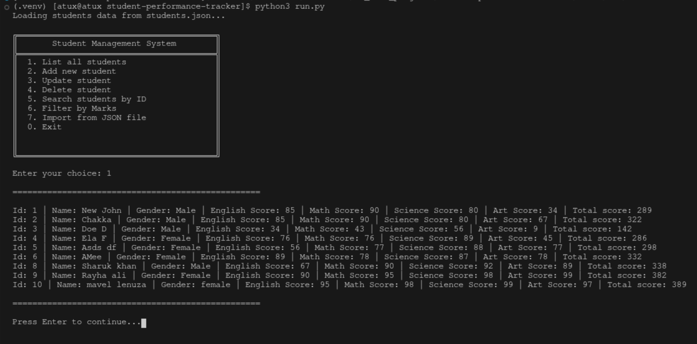
    - Add New Student
      The add student feature guides the user through entering a new student record. It prompts for a full name, gender, and subject scores, validating each input to ensure correctness (name format, gender choice, and score range). After validation, a new Student object is created, assigned a unique ID, added to the in‑memory collection, and then saved to students.json so the data persists across sessions. A confirmation message is displayed with the assigned student ID.
      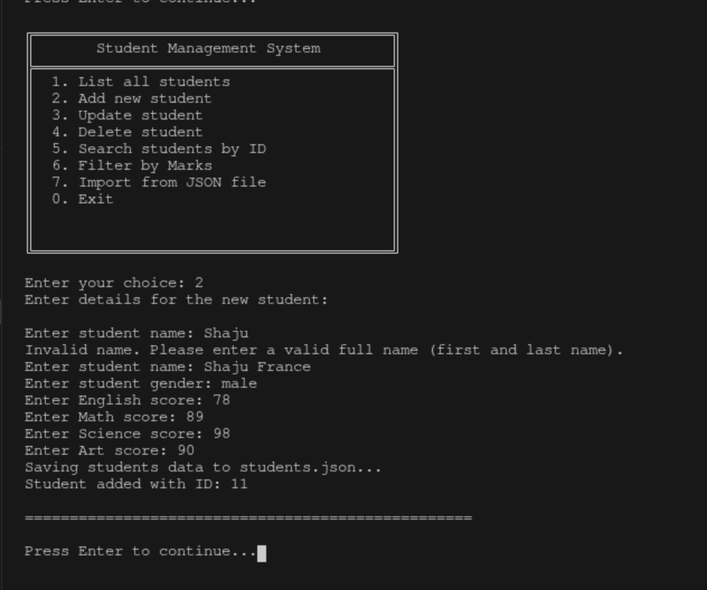

    - Update Student
      The update student feature allows modifying an existing student record by ID. It first searches for the student; if not found, it displays an error. If found, it shows the current details and prompts the user for new values for name, gender, and each subject score. Users can press Enter to skip a field and keep the existing value. Each input is validated using the same rules as adding a student, but empty inputs are allowed to preserve current data. After all updates are collected, the student object is modified in memory, saved to students.json, and a confirmation message is displayed.
      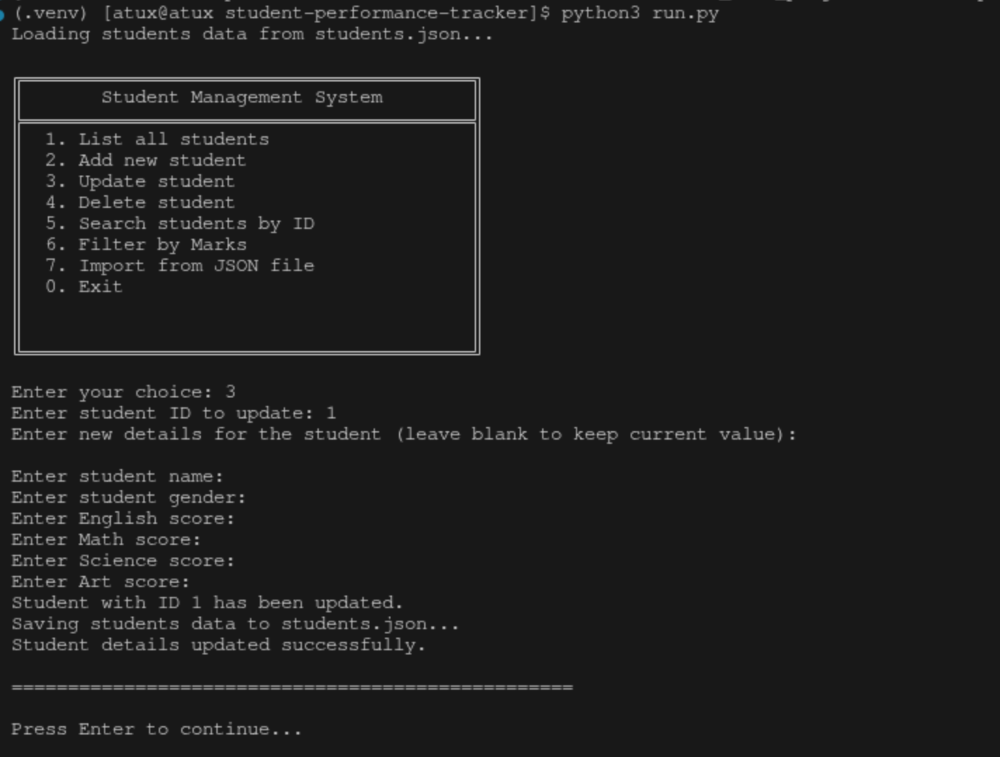

    - Delete  Student
      The delete student feature removes a student record permanently by ID. It prompts the user to enter a student ID, then searches for that record in the collection. If the student is not found, an error message is displayed. If found, the student's details are shown and the user is asked to confirm the deletion. Upon confirmation, the record is removed from the in-memory dictionary, the changes are saved to students.json, and a success message is displayed. This ensures accidental deletions are prevented through the confirmation step.
      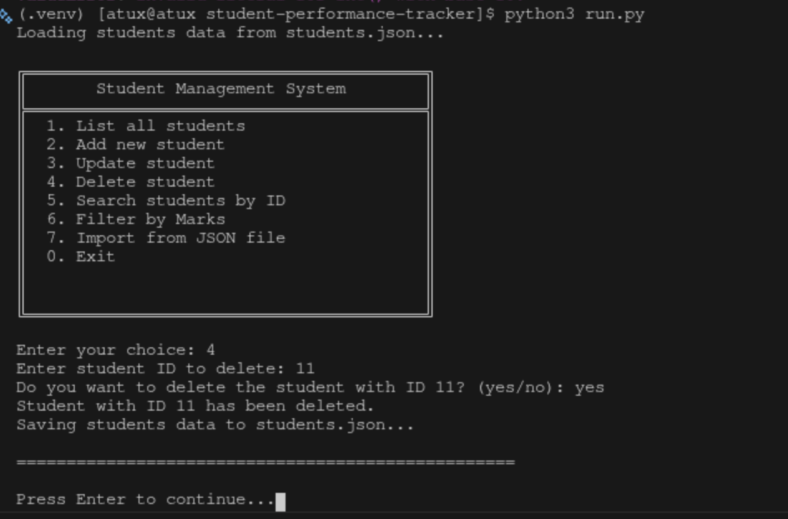

    _ Search Student
      The search student feature allows users to quickly find and view a specific student's record by their unique ID. The user is prompted to enter a student ID, and the system searches the in-memory collection for that record. If the student is found, their complete details—including ID, name, gender, all subject scores, and calculated total score—are displayed in a formatted output. If the ID doesn't exist, an error message informs the user that no student was found with that ID. This provides a fast way to access individual student information without listing all records.
      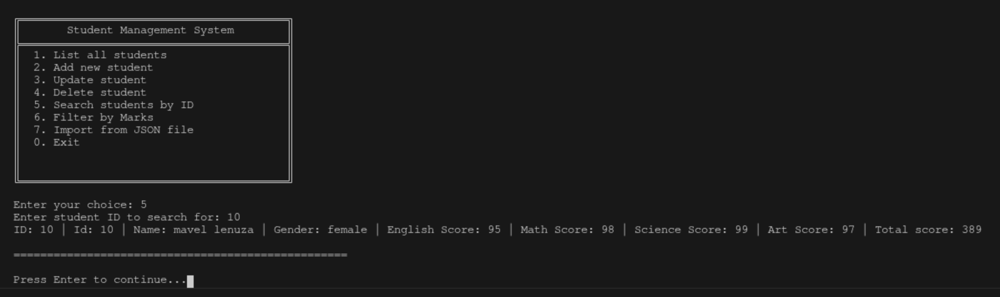

    _ Filter Students
      The filter students feature enables users to view subsets of student records based on their total academic performance. Users can choose from several filtering categories based on total marks: Distinction, First Class, Second Class, Third Class, and Fail. The system calculates each student's total score by adding up all their subject scores (English, Math, Science, and Art) and categorizes them according to the total marks threshold. Students are then displayed only if they match the selected performance category. If no students meet the chosen filter criteria, a message indicates that no records were found. This feature helps quickly identify students who excel or those who may need additional academic support based on their overall performance classification.
      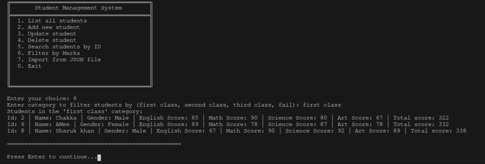

    - Load Json file
      The load JSON file feature reads student data from students.json when the application starts, ensuring that previously saved records are available for use. The system checks if the file exists; if it does, it reads the JSON content and converts each entry back into Student objects, populating the in-memory dictionary with their IDs as keys. The function also updates the next available ID counter to ensure new students receive unique IDs. If the file doesn't exist or is empty (such as on first run), the application starts with an empty student collection and creates the file upon the first save operation. This automatic loading mechanism ensures data persistence across application sessions without requiring manual import steps.
      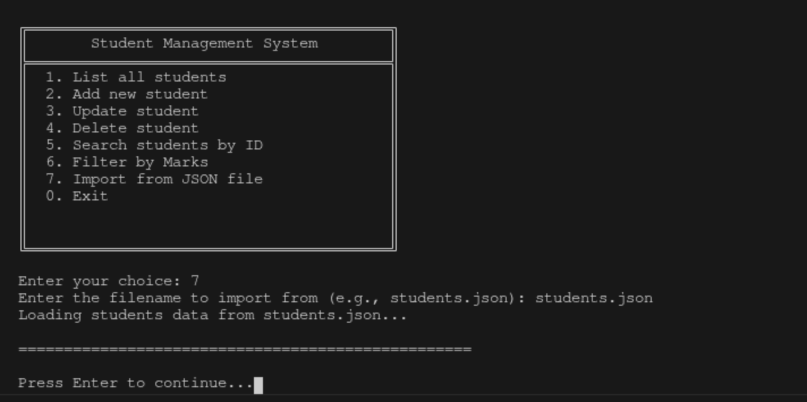

    _ Exit
      The exit feature allows users to safely close the application and terminate the program. When the user selects the exit option from the main menu, the application displays a goodbye message ("Exiting the Student Management System. Goodbye!") and cleanly terminates the program loop. All data modifications made during the session have already been saved to students.json after each add, update, or delete operation, so no data is lost upon exit. This ensures a graceful shutdown of the application and confirms to the user that they are leaving the system.

## Data Model
   Student Class Structure: Each student is represented as a dataclass object with these attributes:

   + id (integer): Unique identifier
   + name (string): Full name
   + gender (string): Male/Female
   + english_score (integer): 0-100
   + math_score (integer): 0-100
   + science_score (integer): 0-100
   + art_score (integer): 0-100

    Storage Structure:
   + Students are stored in a dictionary with ID as the key
   + Data persists in JSON format in students.json

    Business Logic:
   + Auto-incrementing ID system
   + Total score calculation method
   + Validation rules for each field

   ## Testing
   I have manually Tested this project by doing the following:
    - Passed the code through PEP8 linter and confirmed there are no errors
     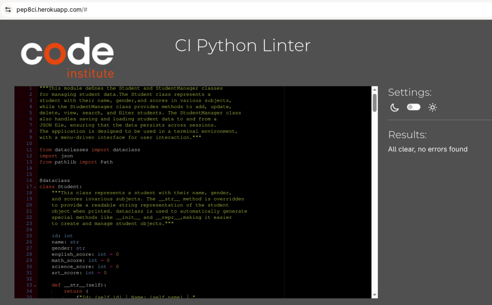

    - Given invalid inputs: strings when numbers are expected, out of the bounds inputs.
      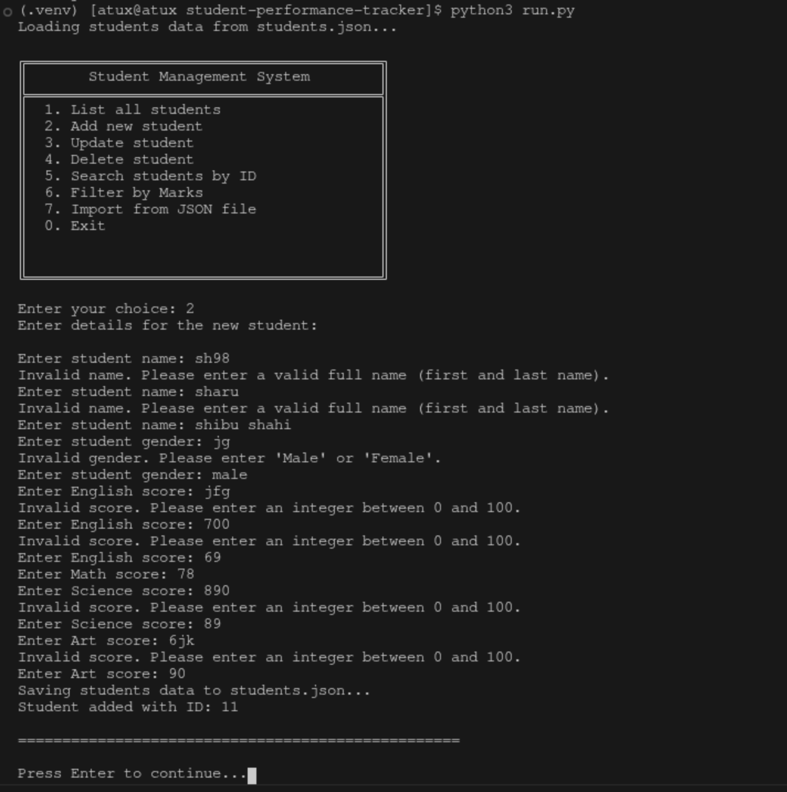
      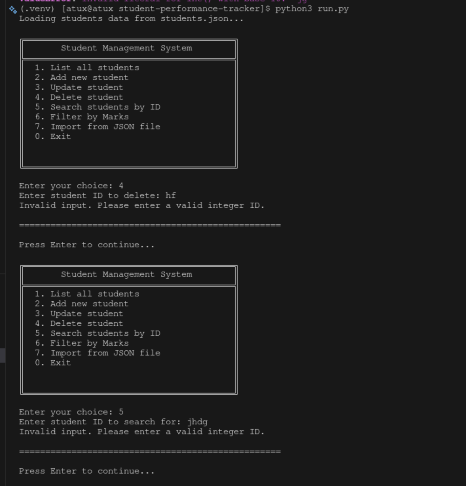

    - Tested in my local Terminal and code institute Heroku Terminal
   ## Bugs
    - Solved Bugs
    - Name Validation Bug: Numbers were being accepted in student names.
      Fixed by adding regex pattern matching to only allow letters, hyphens, and apostrophes.
    - Line Continuation Indentation Errors: The __str__ method had improperly
      aligned continuation lines causing "continuation line under-indented" and "unexpected indentation" errors. Fixed by using parentheses and proper alignment.

    - PEP 8 Line Length: Lines exceeding 79 characters were fixed by splitting
      ternary operators across multiple lines with proper parentheses.

    - Missing Final Newline: Added final newline at the end of Python files to comply
      with PEP 8 standards.

    - Code Formatting: Removed extra spaces in conditional statements
      (e.g., if   updated_data → if updated_data).

    - Remaining Bugs

   ## Deployment
      This Project deploye by Code Institute Heroku Terminal
      Steps for deployment
    - Fork or clone the repositery
    - Create a new Heroku app
    - Set the buildbacks to Python and Nodejs in order to
    - Link the Heroku app to the repositery
    - Click on deploy

    ## Credits
    - Code Institute Deployment Terminal
    - Python Tutorial by Code Institute
    - Python Documentation: Reference for standard library modules (dataclasses, json,
      re, pathlib)
    - PEP 8 Style Guide: Python code formatting standards

